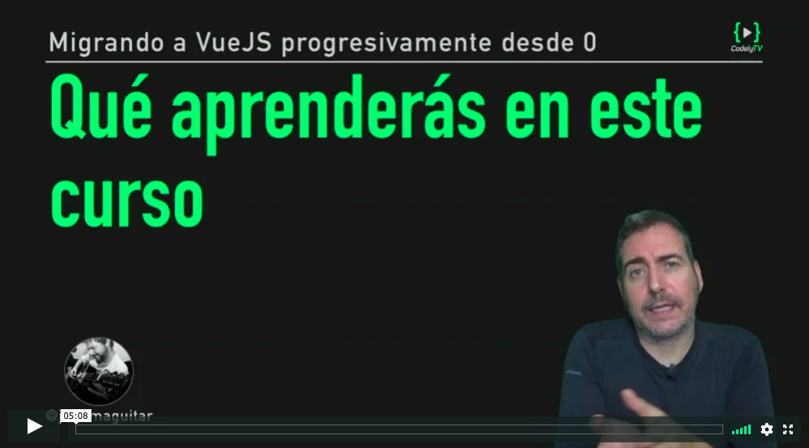

# ¿Qué aprenderás en este curso?

  

_El curso [Migrando a VueJS progresivamente desde 0](https://pro.codely.tv/library/migrando-a-vuejs-progresivamente-desde-0) está disponible a través de [CodelyTV](https://pro.codely.tv/)_

En este curso aprenderás a **refactorizar un frontend ya existente en HTML, CSS, y JavaScript integrando VueJS de forma progresiva**.

El proceso de migración permitirá que convivan "los dos mundos" (el frontend legacy y el nuevo) hasta **conseguir una Single Page Application (SPA) completa**.

Nuestra aplicación Vue final será un blog que obtendrá datos de diferentes APIs externas, y gestionará los comentarios y navegación entre páginas. En el camino **iremos aprendiendo los conceptos de Vue.js que vayamos necesitando para la migración**.

Además del proceso de migración en sí, veremos cómo resolver los nuevos retos que nos plantean las SPA: **Despliegue en producción y Server Side Rendering (SSR) para evitar penalizaciones SEO**.

En resumen, este es un curso de introducción a VueJS como el que no encontrarás en otras plataformas: **Basado en un caso de El Mundo Real™️ donde no podemos partir de 0 o parar el ritmo de desarrollo de nuestro frontend** 🤟

## Qué haremos exactamente?

1. ⚡ **Partiremos de un frontend en HTML+CSS+JS ya existente para un blog** que podría estar generado por cualquier backend tipo Spring (Java), Symfony (PHP), etc.
2. 🔗 Crearemos un widget que se conectará a una API para obtener la temperatura de varias ciudades. Esto nos ayudará a ver cómo empezamos a **introducir VueJS sin alterar el resto del frontend**.
3. 📂 **Refactorizaremos la gestión de comentarios** del blog introduciendo el concepto de componente de Vue
4. 🎯 Migraremos todo el código a un proyecto Vue gestionado por **Webpack**
5. 🗺️ Pasaremos a **gestionar las rutas con VueJS**
6. 🌍 Le daremos vida a nuestro proyecto conectandolo a una **API HTTP externa simulando nuestro backend** para obtener todas las noticias del blog
7. 👀 Optimizaremos nuestra Single Page Application (SPA) en VueJS para **motores de búsqueda** y que así no tengamos penalización en SEO. Aplicaremos Server Side Rendering (SSR) gracias a Nuxt para evitar perder indexación de contenido

## ¿Por qué el enfoque de este curso?

Muchas veces nos encontramos con proyectos frontend servidos desde frameworks backend como Symfony que están hechos con jQuery u otras librerias, y queremos migrar a un framework moderno tipo Vue.

Las soluciones que encontramos en internet suelen ser de todo o nada, de empezar proyectos desde cero con Vue. 

Por eso, en este curso vamos a abordar la migración a Vue partiendo de un template HTML que bien podría estar servido mediante un Symphony. 

## ¿Para quien está dirigido este curso?

* Eres **desarrollador backend** pero quieres aprender cómo se hacen las cosas a día de hoy en el frontend para orientarte a un perfil más **fullstack**
* Tienes experiencia como **programador frontend** y quieres ponerte al día sin que te vuelvan a explicar los conceptos más introductorios de HTML, CSS, y JavaScript como que es un tag HTML, una clase CSS, o una variable en JS
* Estáis pensando en **refactorizar el frontend** de vuestra aplicación ya existente hacia un framework como Vue o React, y te gustaría hacerlo de forma que no frene el ritmo de desarrollo del equipo

## Recursos

En [el repositorio del curso](https://github.com/CodelyTV/vue-progressive-migration-course) tienes las diferentes fases del proyecto separadas por carpetas. [⭐ Stars welcomed](https://github.com/CodelyTV/vue-progressive-migration-course/stargazers)! 

