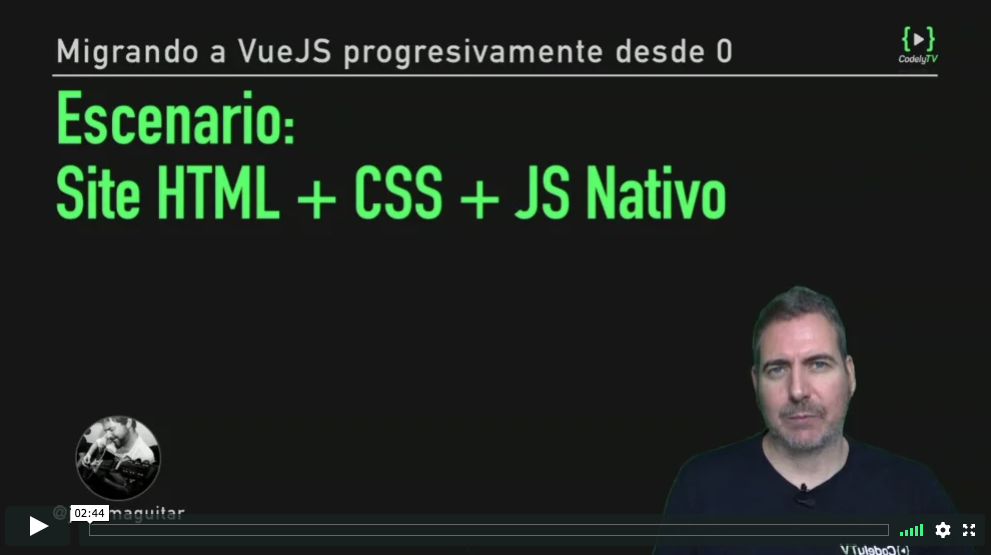
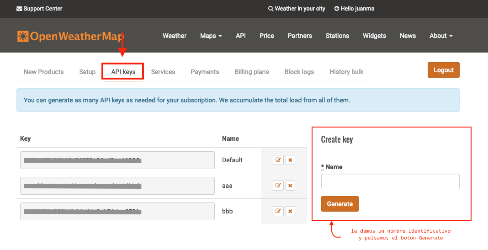

# Escenario - HTML+CSS+JS Nativo

  

_El curso [Migrando a VueJS progresivamente desde 0](https://pro.codely.tv/library/migrando-a-vuejs-progresivamente-desde-0) está disponible a través de [CodelyTV](https://pro.codely.tv/)_

---

Vamos a tomar como punto de partida del curso uno de los [ejemplos que tenemos disponibles desde la página oficial de Bootstrap](https://getbootstrap.com/docs/4.3/examples/)

Conretamente este:

  

Este código base lo teneis disponible en el [repo](https://github.com/CodelyTV/vue-progressive-migration-course/tree/master/01-HTML-CSS)

A partir de este código HTML vamos a crear un widget utilizando la API de [OpenWeatherMap](https://openweathermap.org/)

## Cómo obtener la API Key de OpenWeatherMap

1. Desde la [Home de OpenWeatherMap](https://openweathermap.org/)
2. Nos registramos desde la opción [**Sign Up**](https://home.openweathermap.org/users/sign_up)
3. Una vez registrados, utilizamos nuestro usuario y contraseña para identificarnos en el site a través de la página [**Sign In**](https://home.openweathermap.org/users/sign_in)
4. Nos vamos a la página [**API Keys**](https://home.openweathermap.org/api_keys) y desde ahí generamos nuestra API Key

  

