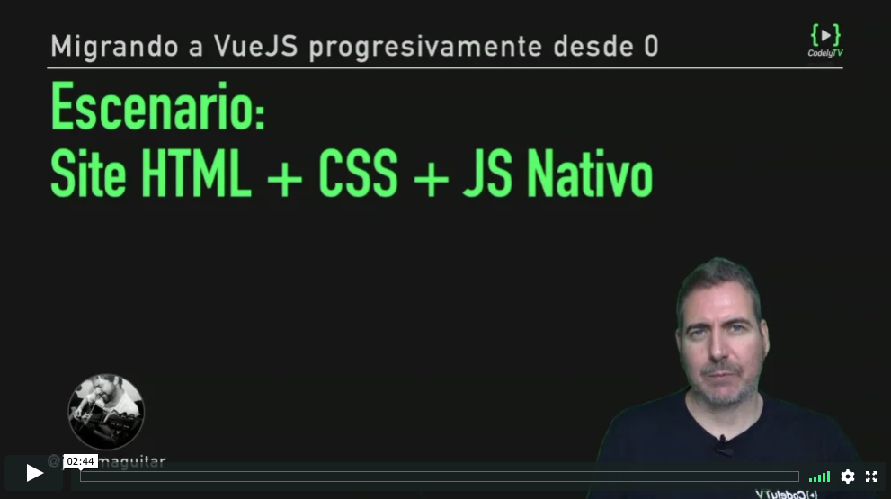
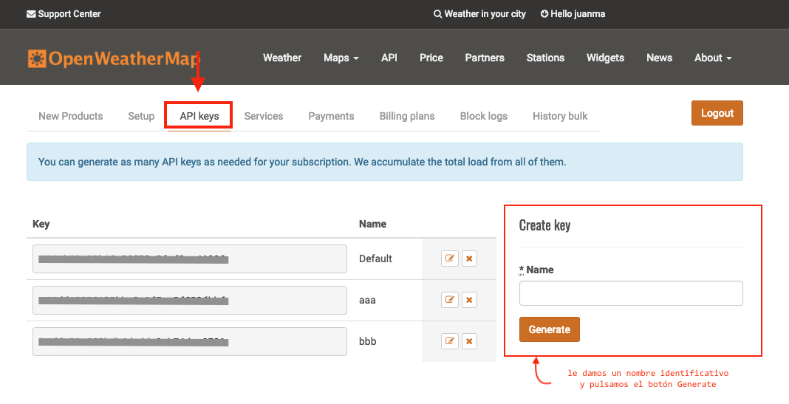

# Escenario - HTML+CSS+JS Nativo

[](https://pro.codely.tv/library/migrando-a-vuejs-progresivamente-desde-0)  

_El curso [Migrando a VueJS progresivamente desde 0](https://pro.codely.tv/library/migrando-a-vuejs-progresivamente-desde-0) está disponible a través de [CodelyTV](https://pro.codely.tv/)_


---

Vamos a tomar como punto de partida del curso uno de los [ejemplos que tenemos disponibles desde la página oficial de Bootstrap](https://getbootstrap.com/docs/4.3/examples/)

Conretamente este:

[](https://getbootstrap.com/docs/4.3/examples/blog/)  

Este código base lo podéis descargar en [un zip desde el repo](https://github.com/CodelyTV/vue-progressive-migration-course/raw/master/01-HTML-CSS/_download/proyecto-base.zip)

A partir de este código HTML vamos a crear un widget utilizando la API de [OpenWeatherMap](https://openweathermap.org/)

## Cómo obtener la API Key de OpenWeatherMap

1. Desde la [Home de OpenWeatherMap](https://openweathermap.org/)
2. Nos registramos desde la opción [**Sign Up**](https://home.openweathermap.org/users/sign_up)
3. Una vez registrados, utilizamos nuestro usuario y contraseña para identificarnos en el site a través de la página [**Sign In**](https://home.openweathermap.org/users/sign_in)
4. Nos vamos a la página [**API Keys**](https://home.openweathermap.org/api_keys) y desde ahí generamos nuestra API Key

[](https://home.openweathermap.org/api_keys)  

## Cargando los `scripts` 

Nos encontramos estos `scripts` en nuestro proyecto base

```html
<script src="https://cdn.jsdelivr.net/npm/vue/dist/vue.js"></script>
<script src="js/main.js"></script>
```

- `vue.js` → Cargamos la libreria VueJS con [uno de los métodos que recomiendan desde su página oficial](https://vuejs.org/v2/guide/#Getting-Started)
- `main.js` → Archivo dummy para comprobar que funciona la carga de JS desde el HTML

Vamos a añadir un par mas

```html
<script src="https://cdn.jsdelivr.net/npm/axios@0.18.0/dist/axios.min.js"></script>
<script src="js/WeatherApiService.js"></script>
```

- `axios.min.js` → Carganmos [**axios**](https://github.com/axios/axios), una de las librerias más populares para gestionar peticiones AJAX 
- `WeatherApiService.js` → Aquí añadiremos la lógica de conexión con la API de OpenWeatherMap de manera agnostica a cualquier framework


## `WeatherApiService.js`

```js
class WeatherApiService {
	constructor(api_key) {
  	this.getUrlApiWeatherSearch = this.getUrlApiWeatherSearch.bind(this, api_key)
  }
  findWeather(location) {
  	const url = this.getUrlApiWeatherSearch(location)
    return axios.get(url)
      .then(({data}) => data)
      .then(({ main }) => main)
  }
  getUrlApiWeatherSearch(api_key, location) {
    return `https://api.openweathermap.org/data/2.5/weather?q=${location}&units=metric&appid=${api_key}`
  }
}
```

Mediante esta clase, que instanciaremos desde nuestro `main.js`, tendremos disponible el método `findWeather` el cual nos devolverá los datos del tiempo de la ciudad que le pasemos

---

El código correspondiente a esta lección lo tienes disponible [aqui](https://github.com/CodelyTV/vue-progressive-migration-course/tree/master/02-WeatherApiService)

