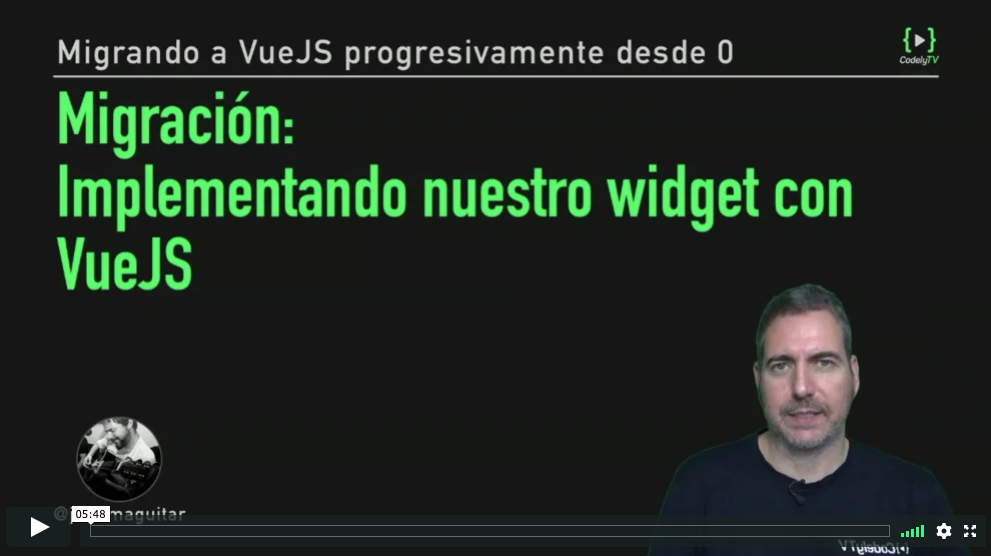

# Migración: Implementando nuestro widget con VueJS

[](https://pro.codely.tv/library/migrando-a-vuejs-progresivamente-desde-0)  

_El curso [Migrando a VueJS progresivamente desde 0](https://pro.codely.tv/library/migrando-a-vuejs-progresivamente-desde-0) está disponible a través de [CodelyTV](https://pro.codely.tv/)_


---

Siguiendo con nuestro proyecto, nos ponemos manos a la obra y añadimos un script dedicado donde añadiremos el código VueJS de nuestro widget

```html
<script src="js/widget-weather.js"></script>
```

## `widget-weather.js`

```js
const API_KEY = '627eb53a00b46c56672e5fef2aa41986'
const service = new WeatherApiService(API_KEY)

const DEFAULT_QUERY='Barcelona'

new Vue({
  el: "#widget",
  data: {
    query: DEFAULT_QUERY,
    temp: 0,
    temp_max: 0,
    temp_min: 0,
  },
  created: function () {
    service.findWeather(DEFAULT_QUERY)
      .then(this.setWeatherData)
  },
  methods: {
    findWeather: function() {
      service.findWeather(this.query)
        .then(this.setWeatherData)
    },
    setWeatherData: function({ temp, temp_max, temp_min }) {
      this.temp = temp
      this.temp_max = temp_max
      this.temp_min = temp_min
    }
  }
})
```

Creamos la instance de nuestro servicio, pasandole nuestra api. 

```js
const service = new WeatherApiService(API_KEY)
```

Y creamos [nuestra instancia Vue](https://vuejs.org/v2/guide/instance.html) utilizando `new Vue()` y pasándole un objeto de configuración que definirá nuestra instancia. En nuestro caso, le pasamos:

```js
{
  el: "...",
  data: {...},
  created: function () {...},
  methods: {...}
}
```

Estas propiedades que le pasamos a la instancia para definirla (y que luego utilizamos para definir componentes), Vue las clasifica en varios grupos

- [Options / Data](https://vuejs.org/v2/api/#Options-Data)
- [Options / DOM](https://vuejs.org/v2/api/#Options-DOM)
- [Options / Lifecycle Hooks](https://vuejs.org/v2/api/#Options-Lifecycle-Hooks)
- [Options / Assets](https://vuejs.org/v2/api/#Options-Assets)
- [Options / Composition](https://vuejs.org/v2/api/#Options-Composition)
- [Options / Misc](https://vuejs.org/v2/api/#Options-Misc)

De las que por ahora nos interesan solo lo siguiente

### [Options / Data](https://vuejs.org/v2/api/#Options-Data)

#### [`data`](https://vuejs.org/v2/api/#data)

Objeto plano con los datos que va manejar la instancia Vue.

```js
data: {
  query: DEFAULT_QUERY,
  temp: 0,
  temp_max: 0,
  temp_min: 0,
},
```


#### [`methods`](https://vuejs.org/v2/api/#methods)

- Métodos que serán mezclados con la instancia Vue. 
- Podemos acceder a ellos desde directivas o desde la instancia. 
- A estos métodos se les _bindea_ automáticamente el `this` de la instancia (por eso desde ellos podemos acceder tranquilamente a `this.query`, `this.setWeatherData`, etc...)

```js
methods: {
  findWeather: function() {
    service.findWeather(this.query)
      .then(this.setWeatherData)
  },
  setWeatherData: function({ temp, temp_max, temp_min }) {
    this.temp = temp
    this.temp_max = temp_max
    this.temp_min = temp_min
  }
}
```


### [Options / DOM](https://vuejs.org/v2/api/#Options-DOM)

#### [`el`](https://vuejs.org/v2/api/#el)

El elemento del DOM donde se va a montar la instancia Vue

```js
el: "#widget",
```


### [Options / Lifecycle Hooks](https://vuejs.org/v2/api/#Options-Lifecycle-Hooks)

#### [`created`](https://vuejs.org/v2/api/#created)

Método que se llama síncronamente cuando se crea la instancia

```js
created: function () {
  service.findWeather(DEFAULT_QUERY)
    .then(this.setWeatherData)
},
```

Aquí utilizamos `service.findWeather` para solicitar los datos de la API cuando se cree la instancia

## El HTML asociado a la instancia

Al indicarle un `el` a la instancia, esto nos permite utilizar [directivas](https://vuejs.org/v2/api/#Directives) vue en ese trozo de HTML para interactuar con nuestra instancia

```html
<div class="p-3 mb-3 bg-light rounded" id="widget">
  <h4 class="font-italic">Temperatura</h4>
  <select v-model="query" v-on:change="findWeather">
      <option selected="selected">Barcelona</option>
      <option>Madrid</option>
      <option>Murcia</option>
    </select>
  <p>Temp: {{ temp }} | Max: {{ temp_max }} | Min: {{ temp_min }}</p>
</div>
```

- Para mostrar datos gestionados por la instancia utilizamos la notación `{{ }}`
- Podemos utilizar directamente elementos tanto de `data` como de `methods` sin necesidad de utilizar `this`
- Con la directiva [`v-model`](https://vuejs.org/v2/api/#v-model) creamos un vinculo entre el valor de este input y uno de los `data` definidos en nuestra instancia
- Con la directiva [`v-on`](https://vuejs.org/v2/api/#v-on) enganchamos un listener a un evento genreado por este componente (el evento `change`) en nuestro caso → El listener es uno de los métodos definidos en nuestra instancia bajo `methods`

---

El código correspondiente a esta lección lo tienes disponible [aqui](https://github.com/CodelyTV/vue-progressive-migration-course/blob/master/03-Vue-basic-widget/)

