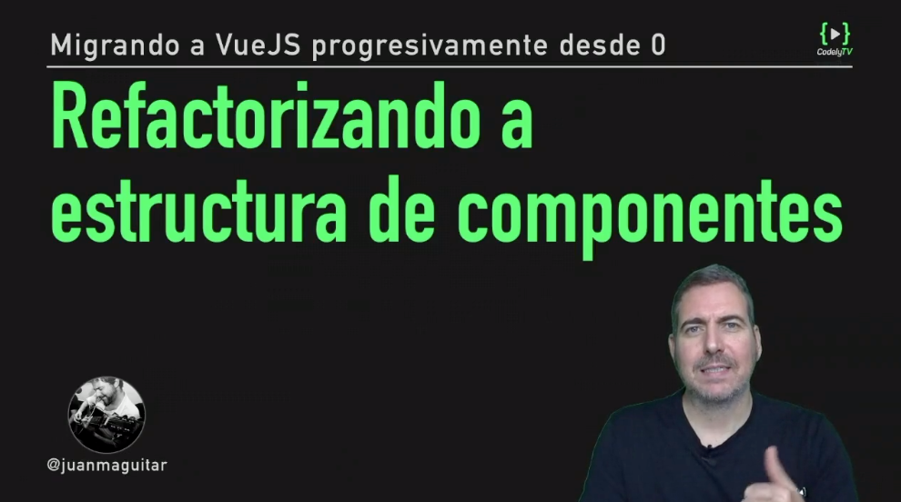
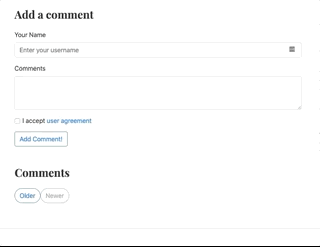

# Planteamiento estructura de componentes y Vue.js DevTools

## Refactorizando a estructura componentes

[](https://pro.codely.tv/library/migrando-a-vuejs-progresivamente-desde-0)  

_El curso [Migrando a VueJS progresivamente desde 0](https://pro.codely.tv/library/migrando-a-vuejs-progresivamente-desde-0) está disponible a través de [CodelyTV](https://pro.codely.tv/)_

En los siguientes videos vamos a construir una serie de componentes que nos permitan implementar esta funcionalidad



con este código en el HTML

```html
<div class="comments" id="comments_block">
	 <comments-form @add-comment="addComment($event)"></comments-form>
	 <comments-list :comments="comments"></comments-list>
</div>
```

---


