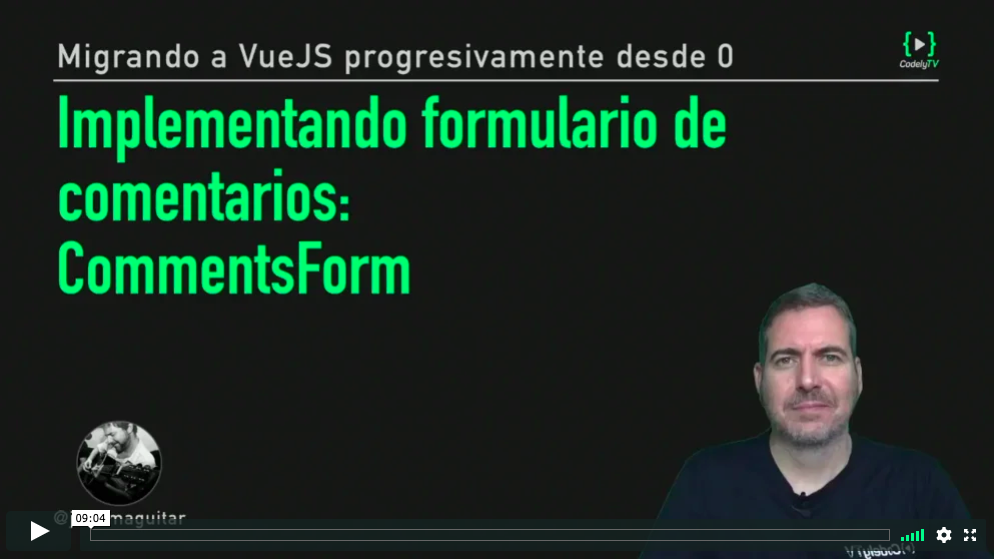

# Componente comentario: CommentsForm

[](https://pro.codely.tv/library/migrando-a-vuejs-progresivamente-desde-0)  

_El curso [Migrando a VueJS progresivamente desde 0](https://pro.codely.tv/library/migrando-a-vuejs-progresivamente-desde-0) está disponible a través de [CodelyTV](https://pro.codely.tv/)_

---

Añadimos un nuevo archivo a nuestra carpeta `components`

```
│   ├── components
│   │   ├── CommentsForm.js
│   │   ├── CommentsItem.js
│   │   └── CommentsList.js
```

Y cargamos este nuevo archivo en nuestro `post.html`

```html
  <script src="js/components/CommentsForm.js"></script>
```

En este nuevo archivo `CommentsForm.js` vamos a generar un componente `comments-form` que nos permita escribir nuestro bloque de comentarios de esta manera

```html
<div class="comments" id="comments_block">
    <comments-form @add-comment="addComment($event)"></comments-form>
    <comments-list :comments="comments"></comments-list>
</div>
```

En este código podemos ver:

#### `<comments-list :comments="comments">` 

Enganchamos dinámicamente con [`v-bind`](https://vuejs.org/v2/api/#v-bind) (shorthand `:`) el valor de `comments` (definido en la instancia Vue) a la prop `comments` ( definida en el componente `comments-list`) → si cambia el `comments` de la instancia se actualizará automaticamente el `comments` de `comments-list`

#### `<comments-form @add-comment="addComment($event)">`

Enganchamos dinámicamente con [`v-on`](https://vuejs.org/v2/api/#v-on) (shorthand `@`) un listener (`addComment`) a un evento propio llamado `add-comment`. Cuando se emita este evento (algo que haremos manualmente) se ejecutará el método `addComment`

El elemento `$event` representa los datos con los se llamará a `addComment`. Sí, en Vue esto se expresa así. Yo que queréis que os diga 🤷‍♂️

## Instancia Vue

A nuestra instancia Vue le vamos a añadir un método para que esté disponible en el bloque de HTML gestionado por Vue 

**`widget-comments.js`**
```js
const comments_data = [...]

new Vue({ 
  el: ...,
  data: {...},
  methods: {
    addComment: function({ username, comment }) {
      comments_data.push({
        id: comments_data.length + 1,
        username,
        comment,
        date: "Today ..."
      })
    }
  }
})
```

Este método, va a añadir un comentario nuevo (con los datos que reciba) en el array `comments_data` → que está asociado reactivamente al `comments` definido en data → que a su vez está _bindeado_ a una prop del componente `comments-list` 

Por esto, en cuando se ejecute este metodo y se añada un nuevo elemento del array se mostrará automáticamente en la lista

## El componente `comments-form`

```js
Vue.component('comments-form', {
  props: ['addComment'],
  data: function() {
  	return {
      username: '',
      comment: ''
    }
  },
  methods: {
    handleSubmit() {
      this.$emit("add-comment", {
        username: this.username,
        comment: this.comment
      });
    }
  },
  template: templateCommentsForm
})
```

### `data`

Fijaros que la propiedad `data` aquí es una función cuando veniamos asignándole directamente un objeto plano. Buneo, esto es así en la definición de componentes

[Aquí](https://vuejs.org/v2/api/#data) el por qué

> When defining a component, data must be declared as a function that returns the initial data object, because there will be many instances created using the same definition. If we use a plain object for data, that same object will be shared by reference across all instances created! By providing a data function, every time a new instance is created we can call it to return a fresh copy of the initial data.

En `data` definimos `username` y `comment` que se enlazan a dos inputs del form vía [`v-model`](https://vuejs.org/v2/api/#v-model)

### `methods`

En el template podemos ver este trozo `<form class="comments_form" @submit.prevent="handleSubmit">` donde se define que el handler que se va a ejecutar cuando se produzca el evento `submit` del formulario es `handleSubmit` (que tenemos disponible en el template al estar definido en methods)

Este método emite manualmente otro evento (esta vez uno que nos hemos inventado nosotros) que es el evento `add-comment` → Emite el evento pasándole unos datos

Este evento acordaros que va a ejecutar `addComment($event)` (definido en la instancia) lanzando el proceso que hemos explicado arriba


---

El código correspondiente a esta lección lo tienes disponible [aqui](https://github.com/CodelyTV/vue-progressive-migration-course/tree/master/06-CommentsForm)

