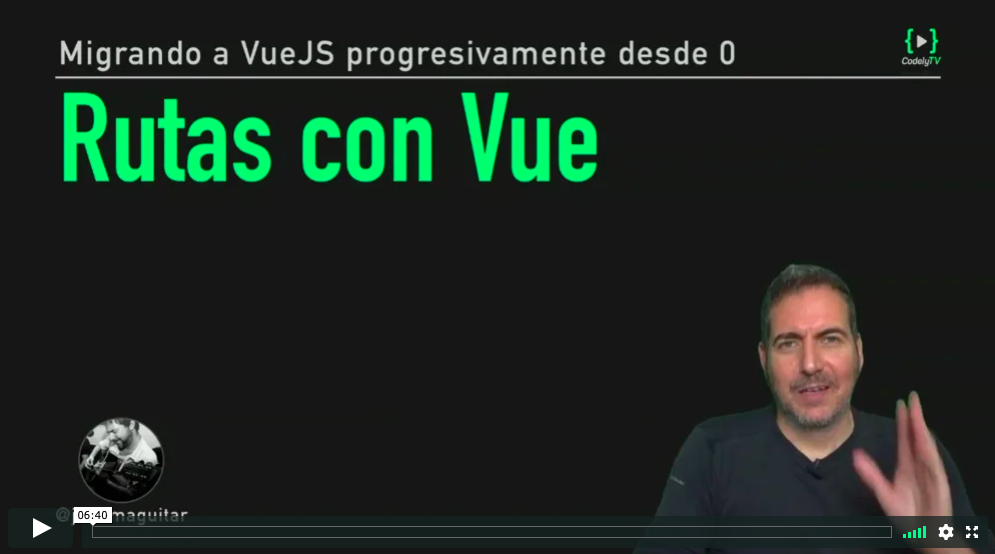

# Migramos la gestión de rutas a VueJS

[](https://pro.codely.tv/library/migrando-a-vuejs-progresivamente-desde-0)  

_El curso [Migrando a VueJS progresivamente desde 0](https://pro.codely.tv/library/migrando-a-vuejs-progresivamente-desde-0) está disponible a través de [CodelyTV](https://pro.codely.tv/)_

---

# Rutas con Vue


<small>`Vue.use` → https://vuejs.org/v2/api/#Vue-use</small>   
<small>Plugins → https://vuejs.org/v2/guide/plugins.html</small>   

<small>Getting Started With Vue Router → https://scotch.io/tutorials/getting-started-with-vue-router</small>   


Las rutas se definen y manejan con un módulo externo llamado [`vue-router`](https://github.com/vuejs/vue-router)

```
npm i -S vue-router
```

Las rutas se definen así...

**`src/router/index.js`**

```javascript
import Vue from 'vue'
import Router from 'vue-router'

Vue.use(Router)

import Home from '../pages/Home.vue'
import Post from '../pages/Post.vue'

export default new Router({
  mode: 'history',
  routes: [
    {
      path: '/home',
      component: Home
    }, 
    {
      path: '/post',
      component: Post
    }
  ]
})
```

Una vez definidas las rutas, las añadimos como parte de la instancia para indicarle a Vue que se encargue de gestionar estas rutas...

**`src/main.js`**

```javascript
import Vue from 'vue'
import App from './App.vue'
import router from './router'

import './css/main.css'

Vue.config.productionTip = false

new Vue({
  ...App,
  router
}).$mount('#app')

```

Y con `router-view` indicamos en que lugar de nuestra app va a aperecer el diferente contenido según la ruta

**`src/App.vue`**

```javascript
<template>
  <div id="app">
    <nav>
      <ul>
        <li>
          <router-link to="/home">Home</router-link>
        </li>
        <li>
          <router-link to="/post">Post</router-link>
        </li>
      </ul>
    </nav>
     <router-view></router-view>
  </div>
</template>

<script>

export default {
  name: 'App'
}
</script>

```


---

El código correspondiente a esta lección lo tienes disponible [aqui](https://github.com/CodelyTV/vue-progressive-migration-course/tree/master/10-routes-home-post)

