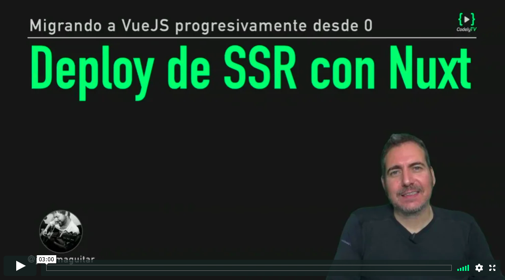

# Deploy SSR con Nuxt

[](https://pro.codely.tv/library/migrando-a-vuejs-progresivamente-desde-0)  

_El curso [Migrando a VueJS progresivamente desde 0](https://pro.codely.tv/library/migrando-a-vuejs-progresivamente-desde-0) está disponible a través de [CodelyTV](https://pro.codely.tv/)_

---

Con [`nuxt build`](https://nuxtjs.org/guide/commands/) generamos la versión de producción de la parte frontend en una carpeta `dist` (necesaria para la versión de producción)

Con esta carpeta `dist` generada, ya podemos subir nuestra app SSR-Nuxt con `now` haciendo sencillamente

```
now
```

`now` detectará que estamos subiendo una aplicación SSR y subirá el codigo a un servidor node que ejecutará nuestro `yarn start`

Así que `now` hará el deploy correspondiente al tipo de servidor adecuado y nos dejará una URL de producción preparada


---

El código correspondiente a esta lección lo tienes disponible [aqui](https://github.com/codelyTV/vue-progressive-migration-course/blob/master/13-ssr-nuxt/)

